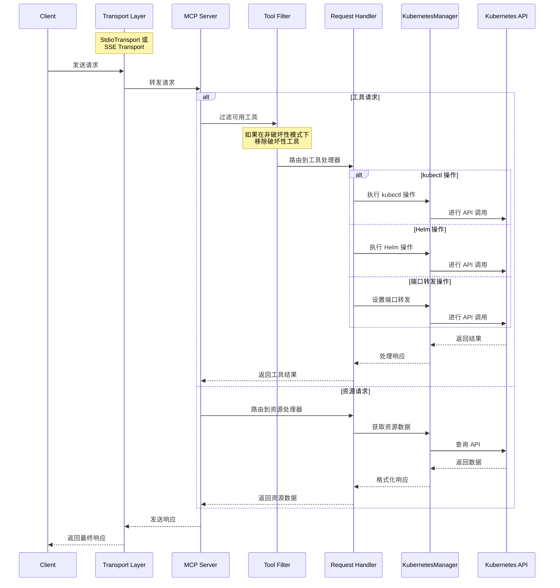

# MCP Server Kubernetes

[](https://github.com/yourusername/mcp-server-kubernetes/actions/workflows/ci.yml)
[](https://github.com/yourusername/mcp-server-kubernetes)
[](https://bun.sh)
[](https://kubernetes.io/)
[](https://www.docker.com/)
[](https://github.com/Flux159/mcp-server-kubernetes/stargazers)
[](https://github.com/Flux159/mcp-server-kubernetes/issues)
[](https://github.com/Flux159/mcp-server-kubernetes/pulls)
[](https://github.com/Flux159/mcp-server-kubernetes/commits/main)
[](https://smithery.ai/protocol/mcp-server-kubernetes)

可以连接到 Kubernetes 集群并管理它的 MCP 服务器。支持按优先级顺序从多个来源加载 kubeconfig。

<https://github.com/user-attachments/assets/f25f8f4e-4d04-479b-9ae0-5dac452dd2ed>

<a href="https://glama.ai/mcp/servers/w71ieamqrt"></a>

## 在 Claude Desktop 中使用

```json
{
  "mcpServers": {
    "kubernetes": {
      "command": "npx",
      "args": ["mcp-server-kubernetes"]
    }
  }
}
```

默认情况下，服务器从 `~/.kube/config` 加载 kubeconfig。有关其他身份验证选项（环境变量、自定义路径等），请参阅 [ADVANCED_README.md](ADVANCED_README.md)。

服务器将自动连接到您当前的 kubectl 上下文。请确保您具备：

1. 已安装 kubectl 并在您的 PATH 中
2. 配置了上下文的有效 kubeconfig 文件
3. 为 kubectl 配置的 Kubernetes 集群访问权限（例如 minikube、Rancher Desktop、GKE 等）
4. 已安装 Helm v3 并在您的 PATH 中（不需要 Tiller）。如果您不打算使用 Helm，这是可选的。

您可以通过要求 Claude 列出您的 pod 或创建测试部署来验证您的连接。

如果遇到错误，请打开标准终端并运行 `kubectl get pods` 以查看是否可以在没有凭据问题的情况下连接到您的集群。

## 与 mcp-chat 一起使用

[mcp-chat](https://github.com/Flux159/mcp-chat) 是一个用于 MCP 服务器的 CLI 聊天客户端。您可以使用它与 Kubernetes 服务器交互。

```shell
npx mcp-chat --server "npx mcp-server-kubernetes"
```

或者，传递上面的现有 Claude Desktop 配置文件（Linux 应传递配置的正确路径）：

Mac：

```shell
npx mcp-chat --config "~/Library/Application Support/Claude/claude_desktop_config.json"
```

Windows：

```shell
npx mcp-chat --config "%APPDATA%\Claude\claude_desktop_config.json"
```

## 功能特性

- [x] 连接到 Kubernetes 集群
- [x] 用于管理资源的统一 kubectl API
  - 使用 `kubectl_get` 获取或列出资源
  - 使用 `kubectl_describe` 描述资源
  - 使用 `kubectl_get` 列出资源
  - 使用 `kubectl_create` 创建资源
  - 使用 `kubectl_apply` 应用 YAML 清单
  - 使用 `kubectl_delete` 删除资源
  - 使用 `kubectl_logs` 获取日志
  - 使用 `kubectl_context` 管理 kubectl 上下文
  - 使用 `explain_resource` 解释 Kubernetes 资源
  - 使用 `list_api_resources` 列出 API 资源
  - 使用 `kubectl_scale` 缩放资源
  - 使用 `kubectl_patch` 更新资源的字段
  - 使用 `kubectl_rollout` 管理部署滚动更新
  - 使用 `kubectl_generic` 执行任何 kubectl 命令
  - 使用 `ping` 验证连接
- [x] 高级操作
  - 使用 `kubectl_scale` 缩放部署（替换旧版 `scale_deployment`）
  - 使用 `port_forward` 端口转发到 pod 和服务
  - 运行 Helm 操作
    - 安装、升级和卸载图表
    - 支持自定义值、仓库和版本
- [x] 故障排除提示（`k8s-diagnose`）
  - 基于关键字和可选命名空间，指导进行系统化的 Kubernetes pod 故障排除流程。
- [x] 非破坏性模式，仅允许读取和创建/更新访问集群

## 提示

MCP Kubernetes 服务器包含专门的提示，以协助进行常见的诊断操作。

### k8s-diagnose 提示

此提示为 Kubernetes pod 提供系统化的故障排除流程。它接受一个 `keyword` 来识别相关的 pod，以及一个可选的 `namespace` 来缩小搜索范围。
提示的输出将指导您完成自主故障排除流程，提供识别问题、收集证据和建议修复步骤的说明。

## 本地开发

确保您已[安装 bun](https://bun.sh/docs/installation)。克隆仓库并安装依赖项：

```bash
git clone https://github.com/Flux159/mcp-server-kubernetes.git
cd mcp-server-kubernetes
bun install
```

### 开发工作流程

1. 在开发模式下启动服务器（监视文件更改）：

```bash
bun run dev
```

2. 运行单元测试：

```bash
bun run test
```

3. 构建项目：

```bash
bun run build
```

4. 使用 [Inspector](https://github.com/modelcontextprotocol/inspector) 进行本地测试

```bash
npx @modelcontextprotocol/inspector node dist/index.js
# 按照终端上的进一步说明获取 Inspector 链接
```

5. 使用 Claude Desktop 进行本地测试

```json
{
  "mcpServers": {
    "mcp-server-kubernetes": {
      "command": "node",
      "args": ["/path/to/your/mcp-server-kubernetes/dist/index.js"]
    }
  }
}
```

6. 使用 [mcp-chat](https://github.com/Flux159/mcp-chat) 进行本地测试

```bash
bun run chat
```

## 贡献

详情请参阅 [CONTRIBUTING.md](CONTRIBUTING.md) 文件。

## 高级功能

### 非破坏性模式

您可以在非破坏性模式下运行服务器，该模式禁用所有破坏性操作（删除 pod、删除部署、删除命名空间等）：

```shell
ALLOW_ONLY_NON_DESTRUCTIVE_TOOLS=true npx mcp-server-kubernetes
```

使用非破坏性模式的 Claude Desktop 配置：

```json
{
  "mcpServers": {
    "kubernetes-readonly": {
      "command": "npx",
      "args": ["mcp-server-kubernetes"],
      "env": {
        "ALLOW_ONLY_NON_DESTRUCTIVE_TOOLS": "true"
      }
    }
  }
}
```

### 非破坏性模式中可用的命令

所有只读和资源创建/更新操作仍然可用：

- 资源信息：`kubectl_get`、`kubectl_describe`、`kubectl_logs`、`explain_resource`、`list_api_resources`
- 资源创建/修改：`kubectl_apply`、`kubectl_create`、`kubectl_scale`、`kubectl_patch`、`kubectl_rollout`
- Helm 操作：`install_helm_chart`、`upgrade_helm_chart`
- 连接性：`port_forward`、`stop_port_forward`
- 上下文管理：`kubectl_context`

### 非破坏性模式中禁用的命令

以下破坏性操作被禁用：

- `kubectl_delete`：删除任何 Kubernetes 资源
- `uninstall_helm_chart`：卸载 Helm 图表
- `cleanup`：清理托管资源
- `kubectl_generic`：通用 kubectl 命令访问（可能包含破坏性操作）

有关其他高级功能，请参阅 [ADVANCED_README.md](ADVANCED_README.md)。

## 架构

请参阅此 [DeepWiki 链接](https://deepwiki.com/Flux159/mcp-server-kubernetes) 获取由 Devin 创建的更深入的架构概述。

本节描述 MCP Kubernetes 服务器的高级架构。

### 请求流程

下面的序列图说明了请求如何在系统中流动：



请参阅此 [DeepWiki 链接](https://deepwiki.com/Flux159/mcp-server-kubernetes) 获取由 Devin 创建的更深入的架构概述。

## 发布新版本

转到[发布页面](https://github.com/Flux159/mcp-server-kubernetes/releases)，点击"Draft New Release"，点击"Choose a tag"并通过输入使用"v{major}.{minor}.{patch}"语义版本格式的新版本号来创建新标签。然后，编写发布标题"Release v{major}.{minor}.{patch}"和描述/变更日志（如有必要），并点击"Publish Release"。

这将创建一个新标签，该标签将通过 cd.yml 工作流触发新的发布构建。成功后，新版本将发布到 [npm](https://www.npmjs.com/package/mcp-server-kubernetes)。请注意，无需手动更新 package.json 版本，因为工作流将自动更新 package.json 文件中的版本号并推送提交到 main。

## 不计划的功能

向 kubectx 添加集群。
