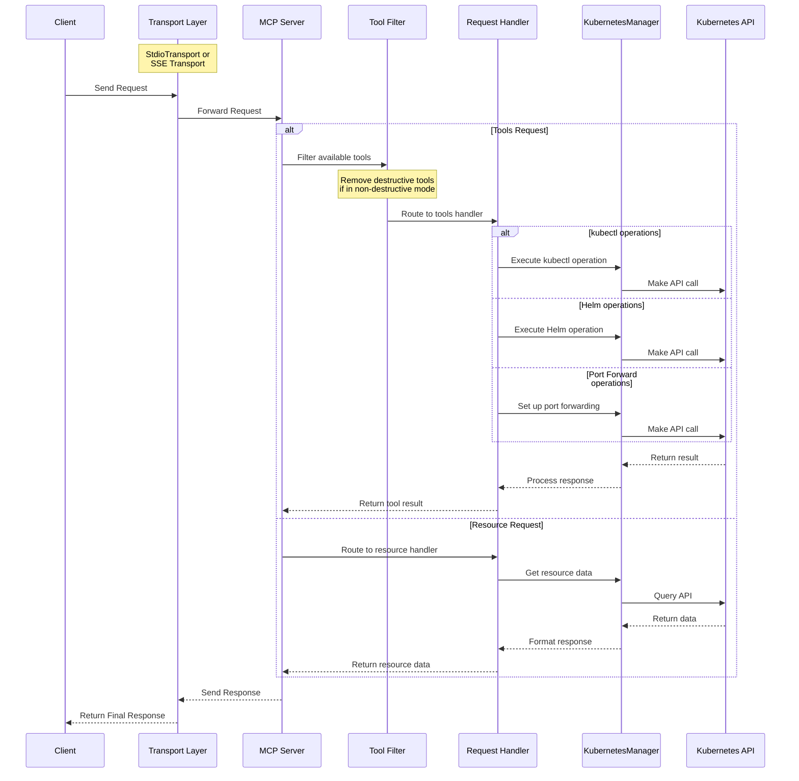

# MCP Server Kubernetes

[](https://github.com/yourusername/mcp-server-kubernetes/actions/workflows/ci.yml)
[](https://github.com/yourusername/mcp-server-kubernetes)
[](https://bun.sh)
[](https://kubernetes.io/)
[](https://www.docker.com/)
[](https://github.com/Flux159/mcp-server-kubernetes/stargazers)
[](https://github.com/Flux159/mcp-server-kubernetes/issues)
[](https://github.com/Flux159/mcp-server-kubernetes/pulls)
[](https://github.com/Flux159/mcp-server-kubernetes/commits/main)
[](https://smithery.ai/protocol/mcp-server-kubernetes)

MCP Server that can connect to a Kubernetes cluster and manage it. Supports loading kubeconfig from multiple sources in priority order.

<https://github.com/user-attachments/assets/f25f8f4e-4d04-479b-9ae0-5dac452dd2ed>

<a href="https://glama.ai/mcp/servers/w71ieamqrt"></a>

## Usage with Claude Desktop

```json
{
  "mcpServers": {
    "kubernetes": {
      "command": "npx",
      "args": ["mcp-server-kubernetes"]
    }
  }
}
```

By default, the server loads kubeconfig from `~/.kube/config`. For additional authentication options (environment variables, custom paths, etc.), see [ADVANCED_README.md](ADVANCED_README.md).

The server will automatically connect to your current kubectl context. Make sure you have:

1. kubectl installed and in your PATH
2. A valid kubeconfig file with contexts configured
3. Access to a Kubernetes cluster configured for kubectl (e.g. minikube, Rancher Desktop, GKE, etc.)
4. Helm v3 installed and in your PATH (no Tiller required). Optional if you don't plan to use Helm.

You can verify your connection by asking Claude to list your pods or create a test deployment.

If you have errors open up a standard terminal and run `kubectl get pods` to see if you can connect to your cluster without credentials issues.

## Usage with mcp-chat

[mcp-chat](https://github.com/Flux159/mcp-chat) is a CLI chat client for MCP servers. You can use it to interact with the Kubernetes server.

```shell
npx mcp-chat --server "npx mcp-server-kubernetes"
```

Alternatively, pass it your existing Claude Desktop configuration file from above (Linux should pass the correct path to config):

Mac:

```shell
npx mcp-chat --config "~/Library/Application Support/Claude/claude_desktop_config.json"
```

Windows:

```shell
npx mcp-chat --config "%APPDATA%\Claude\claude_desktop_config.json"
```

## Features

- [x] Connect to a Kubernetes cluster
- [x] Unified kubectl API for managing resources
  - Get or list resources with `kubectl_get`
  - Describe resources with `kubectl_describe`
  - List resources with `kubectl_get`
  - Create resources with `kubectl_create`
  - Apply YAML manifests with `kubectl_apply`
  - Delete resources with `kubectl_delete`
  - Get logs with `kubectl_logs`
  - Manage kubectl contexts with `kubectl_context`
  - Explain Kubernetes resources with `explain_resource`
  - List API resources with `list_api_resources`
  - Scale resources with `kubectl_scale`
  - Update field(s) of a resource with `kubectl_patch`
  - Manage deployment rollouts with `kubectl_rollout`
  - Execute any kubectl command with `kubectl_generic`
  - Verify connection with `ping`
- [x] Advanced operations
  - Scale deployments with `kubectl_scale` (replaces legacy `scale_deployment`)
  - Port forward to pods and services with `port_forward`
  - Run Helm operations
    - Install, upgrade, and uninstall charts
    - Support for custom values, repositories, and versions
- [x] Troubleshooting Prompt (`k8s-diagnose`)
  - Guides through a systematic Kubernetes troubleshooting flow for pods based on a keyword and optional namespace.
- [x] Non-destructive mode for read and create/update-only access to clusters

## Prompts

The MCP Kubernetes server includes specialized prompts to assist with common diagnostic operations.

### k8s-diagnose Prompt

This prompt provides a systematic troubleshooting flow for Kubernetes pods. It accepts a `keyword` to identify relevant pods and an optional `namespace` to narrow the search.
The prompt's output will guide you through an autonomous troubleshooting flow, providing instructions for identifying issues, collecting evidence, and suggesting remediation steps.

## Local Development

Make sure that you have [bun installed](https://bun.sh/docs/installation). Clone the repo & install dependencies:

```bash
git clone https://github.com/Flux159/mcp-server-kubernetes.git
cd mcp-server-kubernetes
bun install
```

### Development Workflow

1. Start the server in development mode (watches for file changes):

```bash
bun run dev
```

2. Run unit tests:

```bash
bun run test
```

3. Build the project:

```bash
bun run build
```

4. Local Testing with [Inspector](https://github.com/modelcontextprotocol/inspector)

```bash
npx @modelcontextprotocol/inspector node dist/index.js
# Follow further instructions on terminal for Inspector link
```

5. Local testing with Claude Desktop

```json
{
  "mcpServers": {
    "mcp-server-kubernetes": {
      "command": "node",
      "args": ["/path/to/your/mcp-server-kubernetes/dist/index.js"]
    }
  }
}
```

6. Local testing with [mcp-chat](https://github.com/Flux159/mcp-chat)

```bash
bun run chat
```

## Contributing

See the [CONTRIBUTING.md](CONTRIBUTING.md) file for details.

## Advanced

### Non-Destructive Mode

You can run the server in a non-destructive mode that disables all destructive operations (delete pods, delete deployments, delete namespaces, etc.):

```shell
ALLOW_ONLY_NON_DESTRUCTIVE_TOOLS=true npx mcp-server-kubernetes
```

For Claude Desktop configuration with non-destructive mode:

```json
{
  "mcpServers": {
    "kubernetes-readonly": {
      "command": "npx",
      "args": ["mcp-server-kubernetes"],
      "env": {
        "ALLOW_ONLY_NON_DESTRUCTIVE_TOOLS": "true"
      }
    }
  }
}
```

### Commands Available in Non-Destructive Mode

All read-only and resource creation/update operations remain available:

- Resource Information: `kubectl_get`, `kubectl_describe`, `kubectl_logs`, `explain_resource`, `list_api_resources`
- Resource Creation/Modification: `kubectl_apply`, `kubectl_create`, `kubectl_scale`, `kubectl_patch`, `kubectl_rollout`
- Helm Operations: `install_helm_chart`, `upgrade_helm_chart`
- Connectivity: `port_forward`, `stop_port_forward`
- Context Management: `kubectl_context`

### Commands Disabled in Non-Destructive Mode

The following destructive operations are disabled:

- `kubectl_delete`: Deleting any Kubernetes resources
- `uninstall_helm_chart`: Uninstalling Helm charts
- `cleanup`: Cleanup of managed resources
- `kubectl_generic`: General kubectl command access (may include destructive operations)

For additional advanced features, see the [ADVANCED_README.md](ADVANCED_README.md).

## Architecture

See this [DeepWiki link](https://deepwiki.com/Flux159/mcp-server-kubernetes) for a more indepth architecture overview created by Devin.

This section describes the high-level architecture of the MCP Kubernetes server.

### Request Flow

The sequence diagram below illustrates how requests flow through the system:



See this [DeepWiki link](https://deepwiki.com/Flux159/mcp-server-kubernetes) for a more indepth architecture overview created by Devin.

## Publishing new release

Go to the [releases page](https://github.com/Flux159/mcp-server-kubernetes/releases), click on "Draft New Release", click "Choose a tag" and create a new tag by typing out a new version number using "v{major}.{minor}.{patch}" semver format. Then, write a release title "Release v{major}.{minor}.{patch}" and description / changelog if necessary and click "Publish Release".

This will create a new tag which will trigger a new release build via the cd.yml workflow. Once successful, the new release will be published to [npm](https://www.npmjs.com/package/mcp-server-kubernetes). Note that there is no need to update the package.json version manually, as the workflow will automatically update the version number in the package.json file & push a commit to main.

## Not planned

Adding clusters to kubectx.
